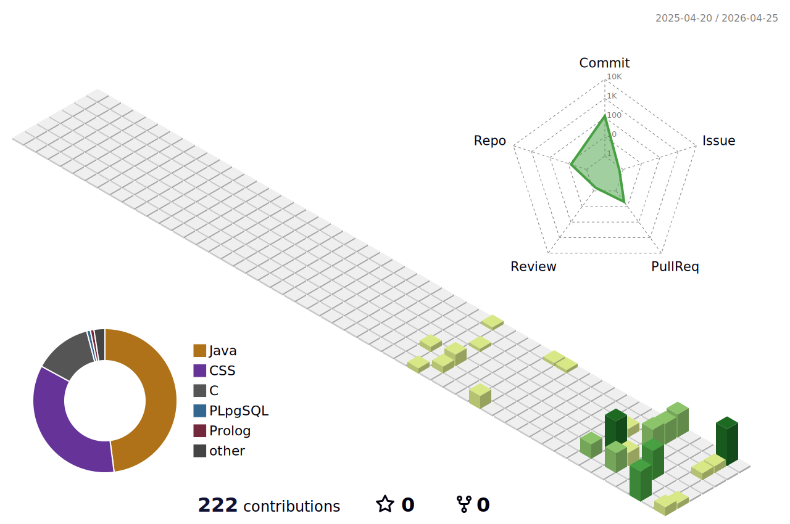

# José Silva

Computer Science and Engineering student in Lisbon focused on systems programming, distributed architecture, and reliable backend software.

---

## About Me

I am a Computer Science and Engineering student at Instituto Superior Tecnico with a strong interest in low-level systems, distributed services, and backend engineering. I am most engaged by problems where architecture, correctness, and execution details all materially affect the outcome.

I tend to approach software from a systems perspective: how components coordinate, where failure modes emerge, and how design choices affect reliability under real constraints. I am particularly interested in early-career roles where I can contribute to infrastructure, backend platforms, and performance-aware software at scale.

---

## Tech Stack

---

## Selected Projects

### PacmanIST
Multi-client game server implemented in C with a strong emphasis on low-level systems programming and inter-process communication.

- Designed a multi-client server architecture in C using named pipes for IPC, allowing independent client processes to communicate with a central game runtime.
- Coordinated game state updates with threads and signals, requiring careful handling of asynchronous events, shared state, and process-level interactions.
- Solved systems challenges around client lifecycle management, synchronization boundaries, and safe message exchange on Linux/POSIX.
- Built the project with explicit attention to correctness, predictable runtime behavior, and the operational realities of low-level software.

### BlockchainIST
Distributed system developed in Java, focused on coordination, synchronization, and transaction consistency.

- Implemented a distributed service architecture in Java using gRPC, defining clear node-to-node communication paths and service boundaries.
- Addressed transaction ordering and synchronization problems to preserve consistent behavior across multiple participants in the system.
- Worked through coordination logic where correctness depended on disciplined state transitions, predictable inter-node behavior, and explicit handling of distributed edge cases.
- Explored practical tradeoffs in distributed design, including communication overhead, service decomposition, and consistency guarantees.

### Database Project
Analytical data project focused on query design, optimization strategy, and efficient reporting workflows.

- Designed OLAP-style query workflows over relational datasets, focusing on efficient aggregation paths and repeatable reporting patterns.
- Improved execution efficiency through indexing strategy and materialized views, reducing repeated computation on heavier analytical workloads.
- Evaluated schema and query tradeoffs with a performance-oriented mindset, balancing maintainability, execution cost, and operational simplicity.
- Used the project to reason more concretely about how physical design choices influence latency and responsiveness under read-heavy workloads.

---

## GitHub Stats

---

## Contribution Activity

---

## What I Care About

- Building systems that remain correct and understandable as complexity increases.
- Understanding architectural tradeoffs across reliability, scalability, and implementation cost.
- Writing software with clear interfaces, disciplined state management, and maintainable structure.
- Solving engineering problems by reasoning from system behavior, not only from feature requirements.

---

## Contact

---

Focused on engineering software that is correct, reliable, and built to scale.

